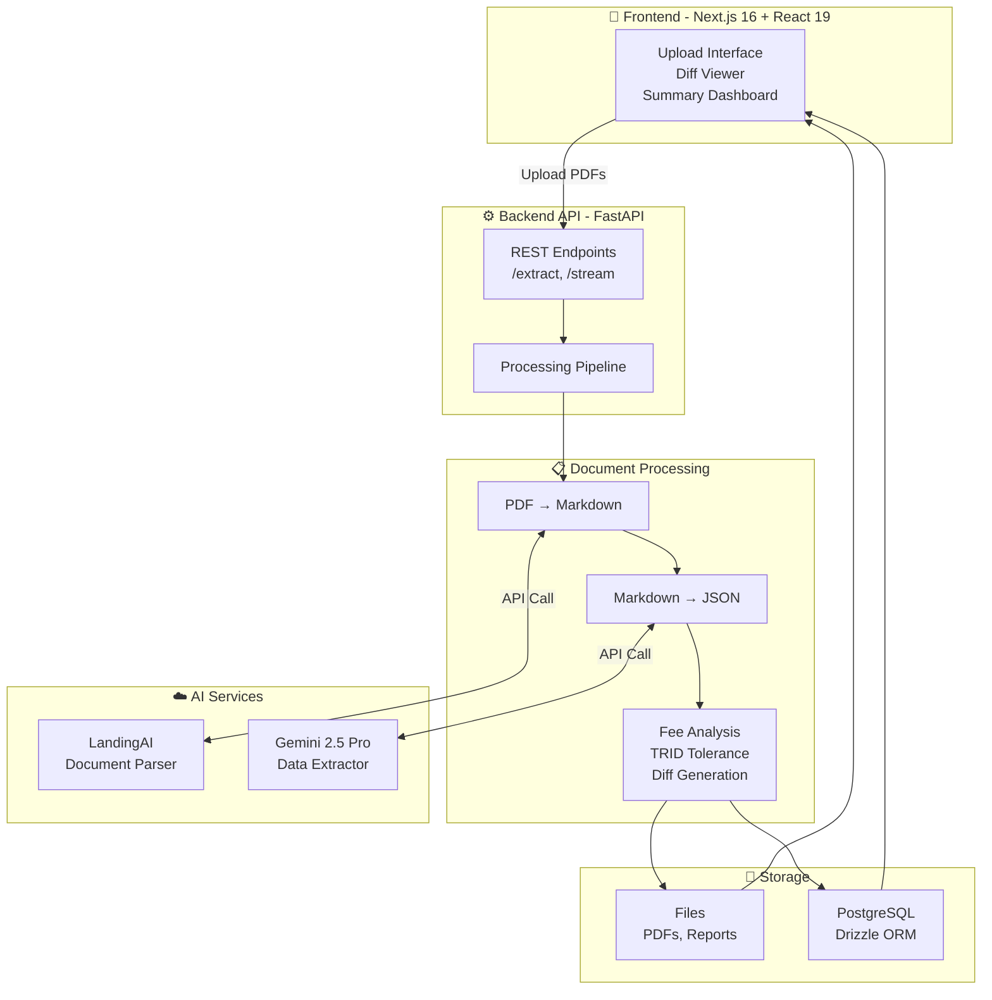

# Fintrid – AI-Powered TRID Analysis & Document Diff Platform

Fintrid is an **end-to-end AI platform** that analyzes Loan Estimates (LE) and Closing Disclosures (CD) for **TRID (TILA-RESPA Integrated Disclosure)** compliance, performs fee-level document diffing, and produces compliance-ready audit reports with visual highlights.

> **Disclaimer:** Fintrid is a decision-support and review tool. It does **not** provide legal advice and does not replace required regulatory reviews.

## 🇺🇸 The Problem We’re Solving

TRID compliance in U.S. mortgage lending is **manual, error-prone, and expensive**:

* **Spreadsheet-based comparisons:** teams match fees line-by-line between LE and CD manually.
* **Label chaos:** “01 Appraisal Fee to ABC” ≠ “Appraisal – ABC Appraisers.”
* **Tolerance penalties:** Missing a 10% bucket breach triggers lender cures and findings.
* **Scattered data:** PDFs, LOS exports, and Excel trackers—all disconnected.
* **Borrower confusion:** fee changes and reclassifications are difficult to explain clearly.

Fintrid automates the entire pipeline—**from raw PDFs to AI-verified, color-highlighted comparisons and curated audit reports**.

## What Fintrid Does

**In one unified flow:**

1. **Ingests PDFs** (Loan Estimates & Closing Disclosures)
2. **Extracts structured data** using LandingAI + Gemini
3. **Detects document type** (LE vs CD)
4. **AI-matches borrower-paid fees**
5. **Detects reclassified fees** (Borrower → Seller/Other)
6. **Evaluates TRID tolerance buckets** (Zero / 10% / Unlimited)
7. **Generates annotated PDF diffs** (visual fee highlights)
8. **Builds curated compliance reports**
9. *(Optional)* **Creates AI-written loan summaries** for easy review

## ✨ Key Features

### 🧾 Document Processing

* **PDF → Markdown → JSON**

  * **LandingAI ADE** converts PDFs into structured Markdown.
  * **Google Gemini 2.5 Pro** extracts fields into strict Pydantic models.
* **Automatic document type detection**

  * Determines whether each file is an LE or CD by fee-structure heuristics.
* **Parallel async pipeline**

  * FastAPI async I/O supports parallel uploads and progress streaming.

## 🧠 AI-Powered TRID Logic

* **Fee Matching & Normalization**

  * Matches **borrower-paid fees only**, even with inconsistent naming.
  * Extracts provider names (e.g. “to ABC Appraisers Inc.”) for transparency.
  * Generates **match-confidence scores** for audit traceability.

* **Reclassification Detection 🆕**

  * Detects when fees move off the borrower (→ Seller / Paid by Others).
  * Marks them as **reclassified**, not missing, and highlights both LE & CD lines.

* **Tolerance Classification**

  * Section A/B → **Zero**
  * Section C (chosen-from-list) / E-Recording → **10%**
  * Section F/G/H → **Unlimited**
  * Handles E-split (Recording vs Transfer Taxes) and changed-circumstance overrides.

* **Aggregate 10% Test & Cure**

  * Aggregates B/C/E(Recording) fees, computes 110% limit, and flags required lender credits automatically.

## 📘 Document Diff & Highlighting 🆕

* **Precise visual diffing**

  * Anchors highlights using **section headers**, **row numbers**, and **amount column position**.
* **Color legend**

  * 🔵 LE Change 🟧 Missing on CD 🟣 CD Change 🟩 New on CD
* **Reclassified Fees**

  * Dual highlights show LE borrower row and CD reclassified row together.
* **Reliable matching**

  * Uses `pdfplumber` layout coordinates + fuzzy text/amount matching.

## 📊 Reporting & Insights

* **Curated TRID PDF Report**

  * Tolerance tables, cure calculations, fee deltas, and compliance summary.
* **AI Financial Profile Summary**

  * Gemini-authored narrative explaining borrower profile, loan terms, fee changes, and risks.
* **Interactive Web UI**

  * Real-time SSE progress updates, side-by-side diff tables, and searchable fee lists.

## Architecture

## 👥 Contributors

* **Jaya Raj Srivathsav Adari**
* **Abhishek Mamidipally**

**Fintrid** — built with ❤️ for compliance teams, auditors, and borrowers who deserve clarity and confidence in every closing.
